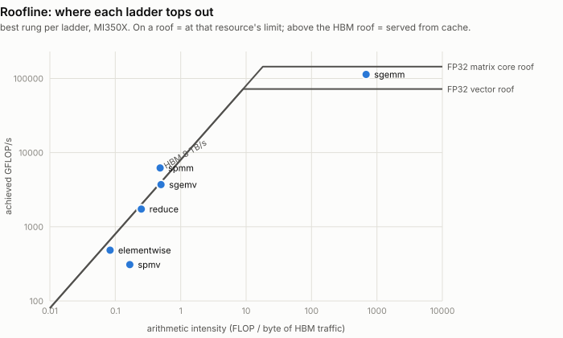

# How to optimize in GPU -- FlyDSL / AMD CDNA edition

A port of [Liu-xiandong/How_to_optimize_in_GPU](https://github.com/Liu-xiandong/How_to_optimize_in_GPU)
from CUDA to **FlyDSL** on **AMD Instinct (CDNA4 / gfx950)**.

The original is a set of optimization *ladders*: for each kernel, a folder of
files where each one adds exactly one idea to the previous one, so the delta
between rungs is the lesson. That structure is preserved here file for file --
one folder per kernel, one file per rung, a README chapter per folder. What changes is the machine underneath: a 64-lane wavefront
instead of a 32-lane warp, 256 CUs instead of 80 SMs, matrix cores instead of
SASS tuning. Every place that forces a different answer is called out in the
folder's README and in [`docs/porting-notes.md`](docs/porting-notes.md).

Every number below was measured on the hardware in the header. Every rung is
verified against a reference before it is timed; a wrong kernel is reported
`FAIL` and its time is suppressed.

```
AMD Instinct MI350X VF (gfx950, wave64) | 256 CU @ 2.2 GHz | LDS 160 KB/CU
HBM 8.0 TB/s | FlyDSL 0.2.4 | ROCm 7.2 | 90/90 rows correct
```

> **Disclaimer.** These are my own measurements, taken on one virtualised MI350X
> partition, as a personal project. They are **not** produced, reviewed,
> validated, or endorsed by AMD, and they are not official AMD performance data.
> Treat them as one person's reproducible data point, not as a benchmark result
> for the hardware. Peak figures quoted as denominators come from AMD's published
> CDNA 4 whitepaper; everything measured is mine.

## What this repo is, and is not

**It is a teaching repo.** Every rung isolates exactly one idea and is written to
be read standalone and diffed against its neighbour. That constraint costs
performance on purpose: rungs duplicate code instead of sharing it, geometry is
written out instead of autotuned, and each kernel stops at the one idea it is
demonstrating rather than stacking every trick that would make it fast.

**These numbers are not what FlyDSL can do.** They are what *these* kernels do,
and the gap is large and deliberate. A production FlyDSL GEMM -- the
`preshuffle_gemm` this repo's tuning notes lean on -- adds a preshuffled B
layout, XOR bank-conflict swizzling, async global-to-LDS copy, a CShuffle
epilogue, and autotuned tile selection. None of that is here. Where a vendor
library wins (see [sgemm](sgemm/)), the honest reading is "this teaching kernel
is slower than a mature library", not "FlyDSL is slower than rocBLAS".

**The datatype is a teaching choice too.** Everything is f32 so the ladders stay
comparable with the CUDA original. On CDNA4 that is the slowest matrix path there
is: the same cores do 2.5 PFLOP/s of FP16 and 5 PFLOP/s of FP8 against 157
TFLOP/s of FP32 -- 16x and 32x more. Anything built for speed rather than for
teaching would start by not using f32.

So read the **deltas between rungs**, which are the lesson, rather than the
absolute numbers as a benchmark of the DSL or the hardware.

---

## Quick start

```bash
export PYTHONPATH=$PWD
PY=/root/flydsl-wgrad-ragged/.venv/bin/python   # the venv with the FlyDSL wheel

$PY -m bench --list                 # every op and its rungs
$PY -m bench                        # run everything
$PY -m bench sgemm --shape 4096     # one op, one shape
$PY -m bench reduce --json out.json # machine-readable results
$PY -m pytest tests -q              # correctness only, fast
```

Or `make list` / `make bench` / `make test`.

---

## Where the ladders end up

<picture>
  <source media="(prefers-color-scheme: dark)" srcset="figure/roofline-dark.svg">
  
</picture>

Each point is one ladder's best rung. A point **on** a roof is at that
resource's limit and no amount of further tuning moves it -- `elementwise` and
`reduce` sit on the HBM diagonal, which is why their last rungs stopped paying.
`spmv` sits well **below** it: the gather into `x` is latency-bound, not
bandwidth-bound, so it never gets to spend the bandwidth it has. `sgemm` is the
only compute-bound ladder, and it sits between the two compute roofs -- past the
vector pipe, short of the matrix cores.

`spmm` plots **above** the HBM roof, which is not an error: its arithmetic
intensity is computed against *logical* traffic, and the dense operand `B` is
re-read enough times to be served largely from cache rather than HBM.

---

## The ladders

Each folder is a chapter. Follow the link for the rung-by-rung table, what
changed from the CUDA original, and why.

### [1. elementwise](elementwise/) -- how wide is one lane's transaction?

`float` / `float2` / `float4` becomes `BufferCopy32b` / `64b` / `128b`. Pure HBM
traffic, so the metric is bandwidth.

**5923 GB/s** with `float4` -- rocBLAS parity, 74% of HBM peak. Wider is better,
exactly as in the original; but a fourth rung showing that *more loads in flight*
does **not** help is kept as a negative result.

### [2. reduce](reduce/) -- the classic ladder, on 64 lanes

Ten rungs from a divergent LDS tree to serial accumulation plus a wave shuffle.

**6940 GB/s = 87% of HBM peak, 4.07x over the baseline and 1.33x PyTorch.** The
decisive rung is serial accumulation, worth more than every tree optimization
before it combined. The last two rungs are additions that did not help.

### [3. sgemv](sgemv/) -- shaping rows onto the wavefront

One wavefront per row, several rows per wavefront, or a whole workgroup per row.

**1.5x-1.95x rocBLAS at every shape tested**, reaching 7.4 TB/s (93% of peak) on
long rows. The CUDA `N == 32` case becomes `N == 64`; packing several rows into a
wavefront divides 64 rather than 32.

### [4. sgemm](sgemm/) -- two levels of blocking, then the matrix cores

Naive, LDS tile, register tile, prefetch, LDS ping-pong, MFMA, and a tuned
matrix-core rung.

**8.1 -> 113.9 TFLOP/s, a 14x span, ending at 84% of rocBLAS.** The vector-FMA
rungs plateau at 97% of the FP32 vector peak; the only move left is the one the
hardware asks for, and `v_mfma_f32_16x16x4_f32` is 1.65x the best of them.

This is the **one op in the repo where the vendor library wins**, at every size.
`v6_tuned` closes most of the gap by picking its tile from the problem shape
(3.1x over v5 at 1024^3), but rocBLAS runs at 94% of the FP32 matrix peak and
this ladder does not get there -- the chapter says why, and what it would take.

### [5. spmv](spmv/) -- the lanes-per-row knob

One kernel, one knob, swept from 1 lane per row to a full wavefront.

The optimum tracks the mean row length -- and on a power-law matrix **a full
wavefront per row is 13.8x the scalar kernel**, because the wavefront is what
absorbs load imbalance.

### [6. spmm](spmm/) -- reusing the sparse row across dense columns

**6202 GFLOP/s** with four output columns per thread. The kernel the CUDA source
labels `// useless optimize` is indeed useless on a uniform matrix (0.72x) and
**4.6x faster** on a power-law one.

---

## Layout

```
elementwise/  reduce/  sgemv/  sgemm/  spmv/  spmm/
    README.md      the chapter: rungs, what changed from CUDA, results
    __init__.py    the ladder: problem, reference, metrics, rungs in order
    <op>_vN_*.py   one file per rung -- diff two of them to see the step
figure/
    <op>-*.svg         the ladder charts, generated from results/bench.json
    access/<op>-vN-*   one access-pattern diagram per rung, generated from a spec
common/
    env.py         hardware detection + the peak figures results are measured against
    dsl.py         shared device-side helpers (copy atoms, shuffles, MFMA, fast launch)
    registry.py    the Op / Variant model the bench and the tests both drive
    sparse.py      reproducible CSR generation (the original's matrices are not in-repo)
bench/             `python -m bench` -- verify, then time, then report
tests/             correctness for every rung at its smallest shape
docs/porting-notes.md   the CUDA->CDNA translation table, the FlyDSL sharp edges,
                        and the results that contradicted expectation
```

`docs/porting-notes.md` is the one to read before writing a new FlyDSL kernel --
in particular Sec. 2.2 (host dispatch masquerading as a bandwidth roof), Sec. 2.3
(shuffles inside `scf.if` are silently wrong), and Sec. 2.7 (`a*b + c` is not an
FMA and costs 6x).

## Caveats

- **Unofficial.** See the disclaimer above: personal measurements, not
  AMD-verified or AMD-endorsed performance data.
- **Not a FlyDSL benchmark.** See "What this repo is, and is not": these are
  teaching kernels, deliberately short of what a production FlyDSL kernel does.
- Measured on an **MI350X VF** (a virtualised partition), one GPU, ROCm 7.2.
  Efficiency percentages use the MI350X clock (2.2 GHz); an MI355X would move the
  denominators up ~9%.
- Everything is f32, to stay comparable with the CUDA original. On CDNA4 that is
  the *worst* datatype in relative terms -- the matrix cores do 2.5 PF of FP16 and
  5 PF of FP8 against 157 TF of FP32. Nothing here is a statement about what the
  hardware can do.
- `torch`/rocBLAS columns are what the installed PyTorch dispatches to, not a
  hand-tuned rocBLAS call. The sparse ones in particular are not tuned paths.

## Credits

This repository exists because of
**[Liu-xiandong/How_to_optimize_in_GPU](https://github.com/Liu-xiandong/How_to_optimize_in_GPU)**
by **Xiandong Liu** (`xiandong_liu@foxmail.com`), released under Apache 2.0.

Everything structural here is theirs: the choice of kernels, the idea of teaching
each one as a folder of files where every file adds exactly one optimization, the
specific sequence of ideas in each ladder (divergence -> bank conflicts ->
add-during-load -> unrolling -> shuffles; global->LDS->register blocking; the
lanes-per-row knob), and the discipline of reporting every rung against the
vendor library rather than against the previous rung alone. The V100 measurements
those ladders were derived from are in the original README and are worth reading
alongside these.

This port contributes the translation to a different machine -- 64-lane
wavefronts, 256 CUs, matrix cores, FlyDSL instead of CUDA C -- plus the CDNA4
measurements, the rungs marked as CDNA additions, and the negative results. Where
a conclusion of the original does not survive the move (the `spmm` "useless
optimize" comment, the V100-sized GEMM tile), that is noted as a difference in
hardware, not a correction: each verdict is right for the machine it was measured
on.

The CDNA4 hardware facts this port budgets against (LDS capacity, HBM bandwidth,
matrix-core throughput -- all reproduced in `common/env.py`) come from AMD's
*Introducing AMD CDNA 4 Architecture* whitepaper and the CDNA4 machine-readable
ISA published at [gpuopen.com](https://gpuopen.com/download/machine-readable-isa/).

## License

**Apache License 2.0** -- the same license as the original repository this ports,
whose `LICENSE` file is carried over here unchanged. See [`LICENSE`](LICENSE) for
the full text and [`NOTICE`](NOTICE) for the derivative-work attribution required
by section 4(d): upstream copyright Xiandong Liu, ported work copyright the
contributors to this repository.
