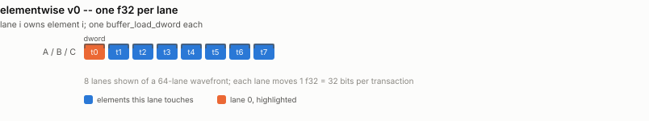
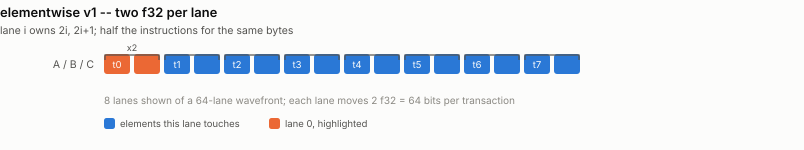
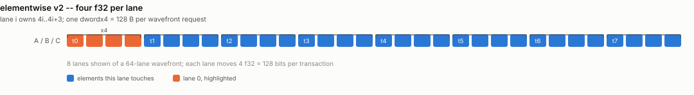
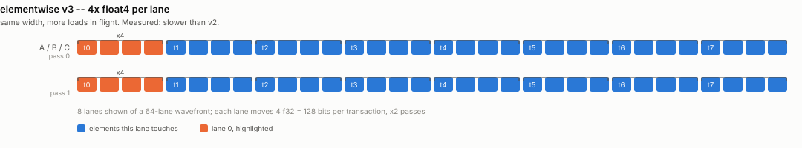
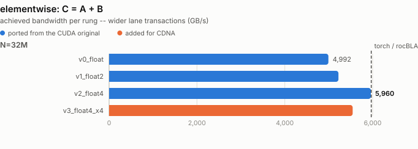

# elementwise -- how wide is one lane's transaction?

Ports `elementwise/elementwise_add.cu`.

`C = A + B` reads 2N and writes N floats and does one add per 12 bytes, so it is
pure HBM traffic and the only metric that means anything is achieved bandwidth.

The original file's whole point is a single axis: how wide is one lane's memory
transaction? CUDA expresses it as `float` / `float2` / `float4` reinterpret
casts. FlyDSL expresses it as the copy *atom* -- `BufferCopy32b` / `64b` /
`128b` -- which lowers to `buffer_load_dword` / `dwordx2` / `dwordx4`. Same axis,
named honestly.

## Rungs

| file | what it adds |
|---|---|
| `elementwise_v0_float.py` | one f32 per lane -- `buffer_load_dword` |
| `elementwise_v1_float2.py` | two f32 per lane -- `dwordx2` |
| `elementwise_v2_float4.py` | four f32 per lane -- `dwordx4` |
| `elementwise_v3_float4_x4.py` | four independent float4s per lane |

One file per rung, as in the original. They differ only in the two constants at
the top of each file (`VEC`, `PER_THREAD`) -- diff any two and the change is the
whole lesson.

## How each rung accesses memory

One picture per rung, showing exactly which thread touches which
element and when -- the thing that actually changes from one rung to
the next. Counts are scaled down to fit a page (16 threads for 256,
8 lanes for 64); the shapes are exact.

### `v0_float`

one f32 per lane (buffer_load_dword)

<picture>
  <source media="(prefers-color-scheme: dark)" srcset="../figure/access/elementwise-v0-dark.svg">
  
</picture>

### `v1_float2`

two f32 per lane (buffer_load_dwordx2)

<picture>
  <source media="(prefers-color-scheme: dark)" srcset="../figure/access/elementwise-v1-dark.svg">
  
</picture>

### `v2_float4`

four f32 per lane (buffer_load_dwordx4)

<picture>
  <source media="(prefers-color-scheme: dark)" srcset="../figure/access/elementwise-v2-dark.svg">
  
</picture>

### `v3_float4_x4`

4x float4 per lane -- more loads in flight

<picture>
  <source media="(prefers-color-scheme: dark)" srcset="../figure/access/elementwise-v3-dark.svg">
  
</picture>

<picture>
  <source media="(prefers-color-scheme: dark)" srcset="../figure/elementwise-dark.svg">
  
</picture>

## Results

> Measured on an AMD Instinct MI350X VF (gfx950, wave64), 256 CU @ 2.2 GHz,
> ROCm 7.2, FlyDSL 0.2.4. Unofficial -- see the disclaimer in the top-level README.

| rung | N=32M | N=256M | vs rocBLAS |
|---|---|---|---|
| `v0_float` | 5283 GB/s | 5127 GB/s | 0.88x |
| `v1_float2` | 5649 GB/s | 5381 GB/s | 0.92x |
| `v2_float4` | **5923 GB/s** | **5869 GB/s** | **1.00x** |
| `v3_float4_x4` | 5574 GB/s | 5597 GB/s | 0.94x |

Same conclusion as the original: wider is better, and `float4` matches the vendor
library exactly (5923 vs 5924 GB/s -- both are at the same roof).

`v3` is a **negative result kept on purpose**. It was added expecting that a
256-CU part would need more memory-level parallelism than one dwordx4 per lane
supplies. It does not: four independent float4s per lane is *slower* than one.
Once the transaction is 128 bits wide the kernel is at the roof and extra loads
in flight only cost registers.
