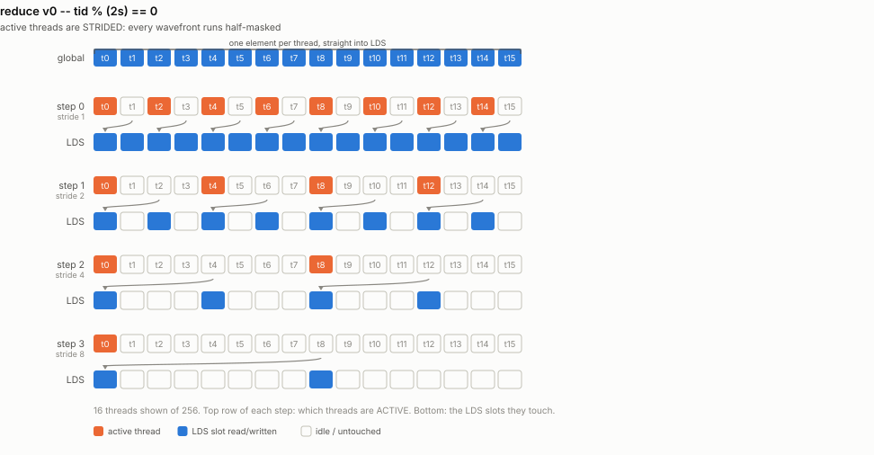
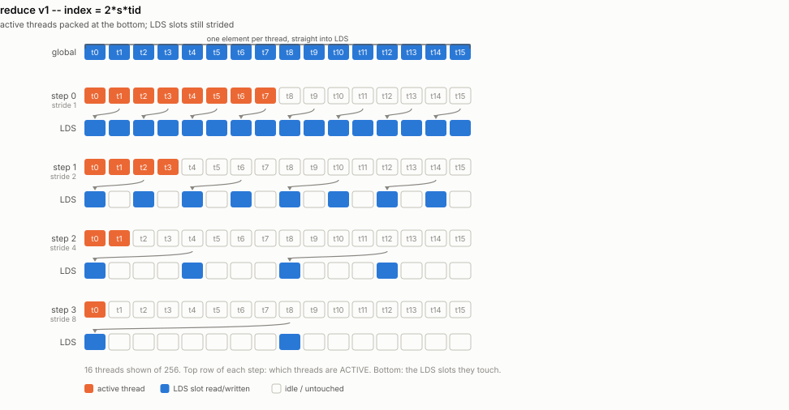
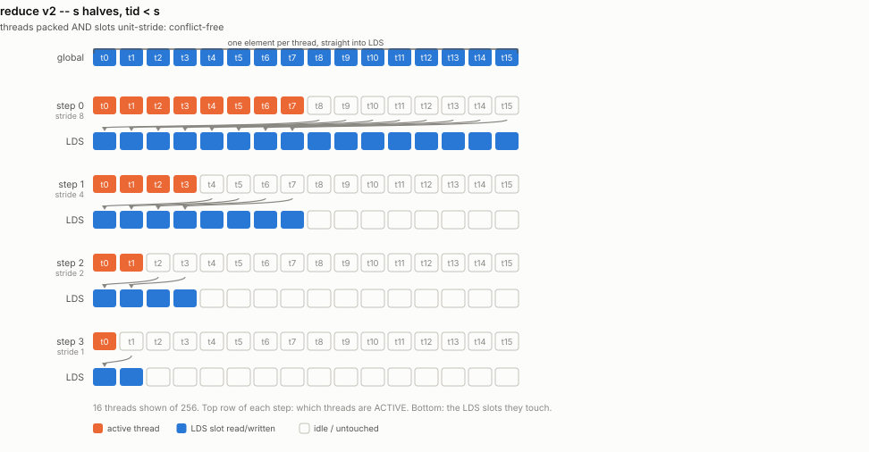
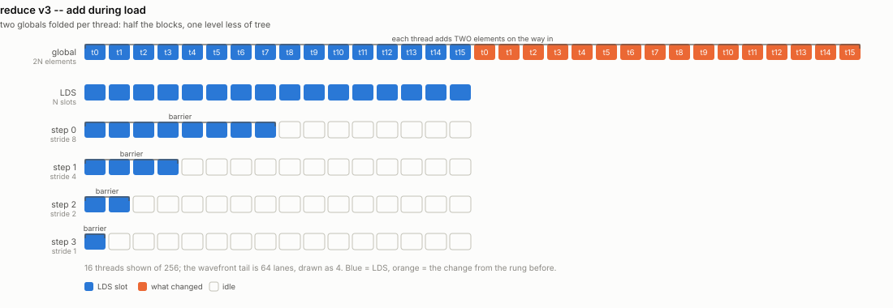
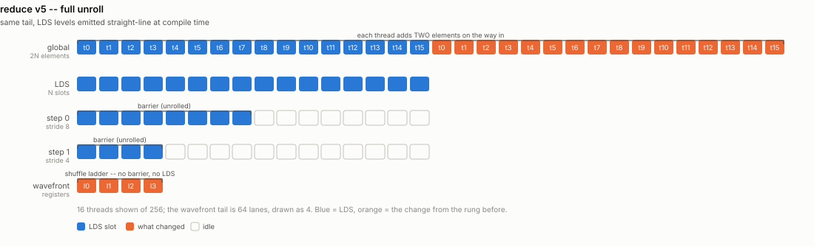
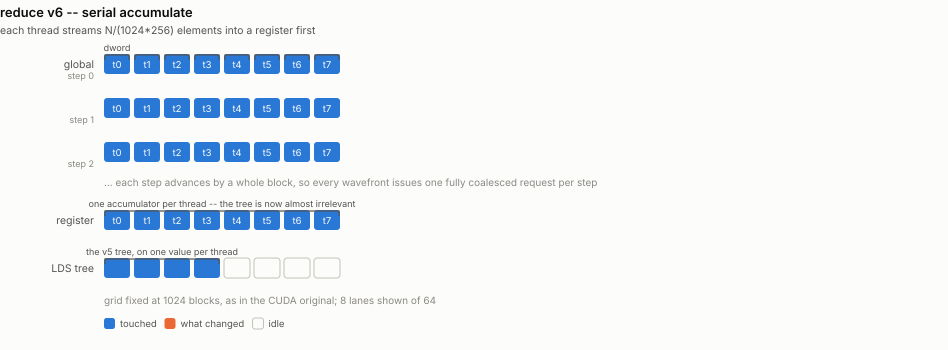
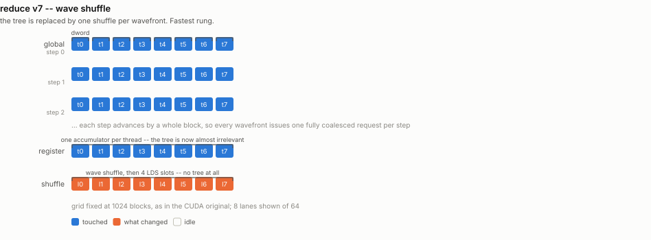
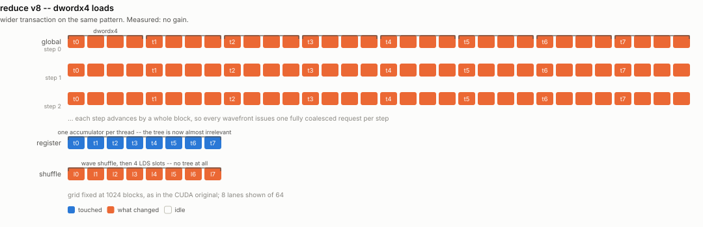
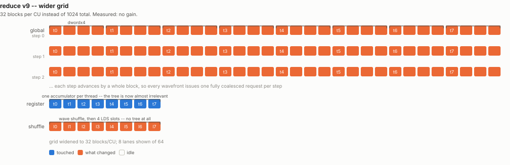
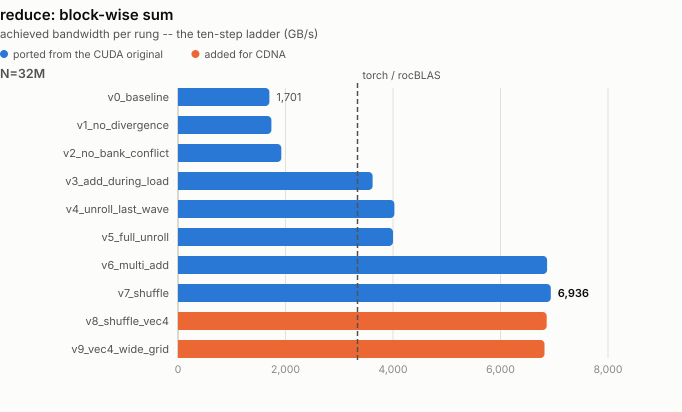

# reduce -- the classic ladder, on 64 lanes

Ports `reduce/reduce_v0_baseline.cu` .. `reduce_v7_shuffle.cu`.

Each block reduces one contiguous chunk of the input to a single float, so with
`E` elements per block the output has `N/E` entries -- exactly the original's
`d_out[blockIdx.x]`. The rungs consume different `E` (256, then 512 once a thread
adds during load, then a large chunk once it accumulates serially), so they emit
different-length outputs while reading the same `N` floats. As in the original
README, the number that compares them is **bytes read per second**.

## What it computes

A **segmented** sum -- not a full reduction to one scalar. Each block reduces
one contiguous chunk to a single float, exactly as the CUDA original's
`d_out[blockIdx.x]` does:

```
y[b] = sum( x[b*E : (b+1)*E] )        for b in 0 .. N/E - 1
```

| operand | shape / dtype | role |
|---|---|---|
| `x` | `f32[N]` | input |
| `y` | `f32[N/E]` | output, one partial sum per block |
| `E` | -- | elements one block consumes: 256, 512, or `N/1024` depending on the rung |

`E` changes as the ladder progresses (the CUDA files change their grid the same
way), so the rungs emit **different-length outputs from the same input**. That
is why they are compared on bytes read per second rather than on wall clock.

**Reference:** `x.view(-1, E).sum(dim=1)`, checked **bit-exact** (rtol 0,
atol 0). The input is random integers in `[0, 8)`, so every partial sum is an
exactly representable f32 integer (worst case `8 * 32768 = 262144`, well under
`2^24`). Summation order therefore cannot change the answer -- a rung that
reassociates the adds is indistinguishable from one that does not, which is
what lets the ladder be checked exactly instead of within a tolerance that
could mask a real bug.

**Metric:** `N * 4 bytes / time`. The kernel reads N floats and writes N/E, so
it is read-dominated and the output is rounding error in the traffic.

## Rungs

| file | what it adds |
|---|---|
| `reduce_v0_baseline.py` | LDS tree, `tid % (2s) == 0` -- divergent inside every wavefront |
| `reduce_v1_no_divergence.py` | `index = 2*s*tid` -- active lanes packed |
| `reduce_v2_no_bank_conflict.py` | `s` halving with `tid < s` -- conflict-free LDS |
| `reduce_v3_add_during_load.py` | fold two globals into one LDS slot |
| `reduce_v4_unroll_last_wave.py` | the last wavefront finishes in registers, no barrier |
| `reduce_v5_full_unroll.py` | LDS levels emitted straight-line at compile time |
| `reduce_v6_multi_add.py` | serial accumulation per thread, then the tree |
| `reduce_v7_shuffle.py` | serial accumulation, then a wave shuffle |
| `reduce_v8_shuffle_vec4.py` | v7 with dwordx4 loads |
| `reduce_v9_vec4_wide_grid.py` | v8 on 32 blocks per CU |

One file per rung, as in the original -- read them in order and each is a single
idea applied to the one before it. `_common.py` holds the constants and the LDS
storage struct they share; `__init__.py` is the ladder.

## Where this departs from the CUDA original

**`v4`/`v5` -- "unroll the last warp".** The CUDA trick is that a warp is 32
lanes and executes in lockstep, so the tail of the tree needs no
`__syncthreads()`, only `volatile`. A CDNA wavefront is **64** lanes, so the
barrier-free tail starts twice as early and covers one more level. FlyDSL has no
`volatile` memref, so the tail is done in registers through cross-lane shuffles
-- strictly better than the LDS round-trip it replaces, and what a CDNA
programmer would write. The rung still isolates the same effect: the tail of the
tree stops paying for workgroup barriers.

**`v7` -- "shuffle".** `__shfl_down_sync(0xffffffff, v, d)` becomes `gpu.shuffle`
in `down` mode over 64 lanes, so the ladder is 6 steps rather than 5 and the
cross-wave LDS array holds 4 partials for a 256-thread block instead of 8.

**`v8`/`v9` have no CUDA counterpart** and neither delivers a win -- see below.

## How each rung accesses memory

One picture per rung, showing exactly which thread touches which
element and when -- the thing that actually changes from one rung to
the next. Counts are scaled down to fit a page (16 threads for 256,
8 lanes for 64); the shapes are exact.

### `v0_baseline`

LDS tree, tid % (2s) == 0 -- divergent

<picture>
  <source media="(prefers-color-scheme: dark)" srcset="../figure/access/reduce-v0-dark.svg">
  
</picture>

### `v1_no_divergence`

index = 2*s*tid -- active lanes contiguous

<picture>
  <source media="(prefers-color-scheme: dark)" srcset="../figure/access/reduce-v1-dark.svg">
  
</picture>

### `v2_no_bank_conflict`

s halving, tid < s -- conflict-free LDS

<picture>
  <source media="(prefers-color-scheme: dark)" srcset="../figure/access/reduce-v2-dark.svg">
  
</picture>

### `v3_add_during_load`

fold 2 globals per thread before the tree

<picture>
  <source media="(prefers-color-scheme: dark)" srcset="../figure/access/reduce-v3-dark.svg">
  
</picture>

### `v4_unroll_last_wave`

last 64 lanes finish in registers, no barrier

<picture>
  <source media="(prefers-color-scheme: dark)" srcset="../figure/access/reduce-v4-dark.svg">
  
</picture>

### `v5_full_unroll`

LDS levels emitted straight-line (constexpr)

<picture>
  <source media="(prefers-color-scheme: dark)" srcset="../figure/access/reduce-v5-dark.svg">
  
</picture>

### `v6_multi_add`

serial accumulate N/262144 per thread, then the tree

<picture>
  <source media="(prefers-color-scheme: dark)" srcset="../figure/access/reduce-v6-dark.svg">
  
</picture>

### `v7_shuffle`

serial accumulate, then wave shuffle + 4 LDS slots

<picture>
  <source media="(prefers-color-scheme: dark)" srcset="../figure/access/reduce-v7-dark.svg">
  
</picture>

### `v8_shuffle_vec4`

v7 with dwordx4 loads

<picture>
  <source media="(prefers-color-scheme: dark)" srcset="../figure/access/reduce-v8-dark.svg">
  
</picture>

### `v9_vec4_wide_grid`

v8 on a 8192-block grid (32/CU)

<picture>
  <source media="(prefers-color-scheme: dark)" srcset="../figure/access/reduce-v9-dark.svg">
  
</picture>

<picture>
  <source media="(prefers-color-scheme: dark)" srcset="../figure/reduce-dark.svg">
  
</picture>

## Results

> Measured on an AMD Instinct MI350X VF (gfx950, wave64), 256 CU @ 2.2 GHz,
> ROCm 7.2, FlyDSL 0.2.4. Unofficial -- see the disclaimer in the top-level README.

| rung | N=32M | speedup | N=256M |
|---|---|---|---|
| `v0_baseline` | 1704 GB/s | 1.00x | 1521 GB/s |
| `v1_no_divergence` | 1739 GB/s | 1.02x | 1539 GB/s |
| `v2_no_bank_conflict` | 1928 GB/s | 1.13x | 1671 GB/s |
| `v3_add_during_load` | 3637 GB/s | 2.13x | 3150 GB/s |
| `v4_unroll_last_wave` | 4001 GB/s | 2.35x | 3501 GB/s |
| `v5_full_unroll` | 4021 GB/s | 2.36x | 3504 GB/s |
| `v6_multi_add` | 6861 GB/s | 4.03x | 6273 GB/s |
| `v7_shuffle` | **6940 GB/s** | **4.07x** | **6303 GB/s** |
| `v8_shuffle_vec4` | 6862 GB/s | 4.03x | 6176 GB/s |
| `v9_vec4_wide_grid` | 6825 GB/s | 4.01x | 6214 GB/s |

**6.94 TB/s is 87% of the 8 TB/s HBM peak, and 1.33x PyTorch's segmented sum.**

The decisive rung is `v6`: giving each thread enough serial work that the tree
stops mattering is worth more (1.7x over `v5`) than every tree optimization
before it combined. After that the kernel is at the memory roof, which is why
`v8` and `v9` -- a wider transaction and a CDNA-sized grid -- move nothing. Both
are kept: a ladder that shows only the steps that worked is not a ladder.
