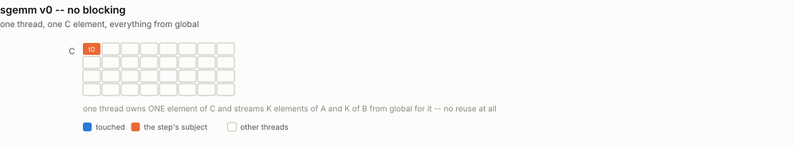
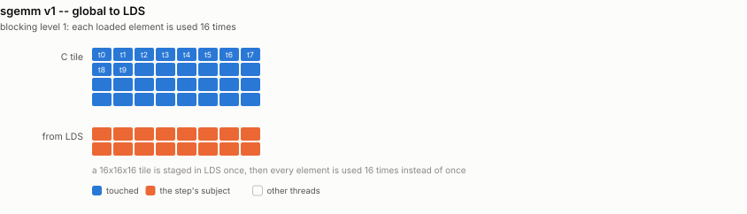
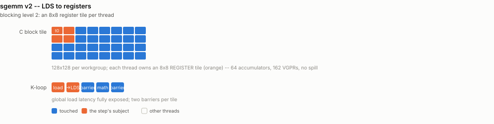
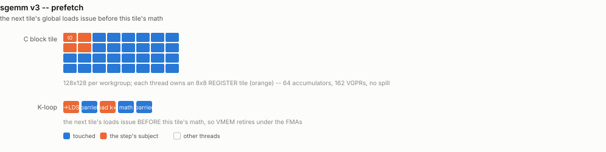
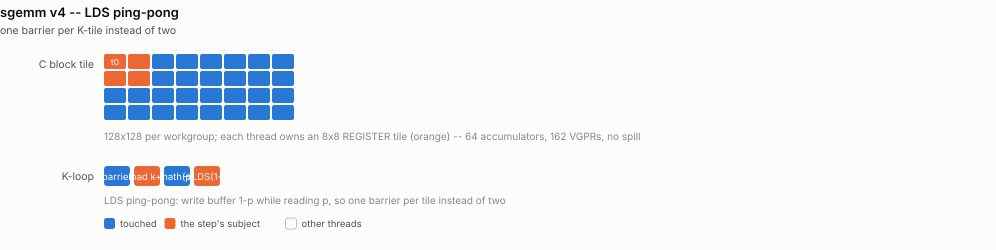
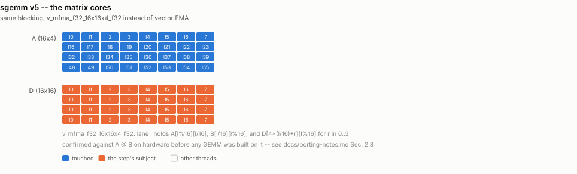
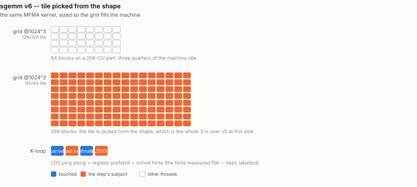
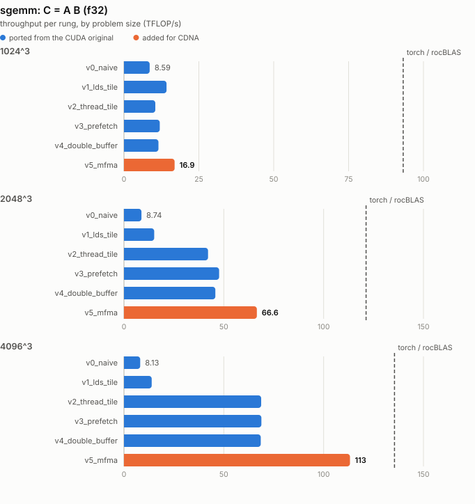

# sgemm -- two levels of blocking, then the matrix cores

Ports `sgemm/sgemm_v1.cu` and `sgemm/sgemm_v3.cu`.

The CUDA repo's thesis is that a fast SGEMM is a *blocking* problem solved twice:
once from global memory into shared memory, and again from shared memory into
registers, with the second level being what actually raises arithmetic
intensity. The ladder here makes each level explicit and then adds the step CDNA
asks for.

## What it computes

```
C[m][n] = sum over k of A[m][k] * B[k][n]
```

| operand | shape / dtype | role |
|---|---|---|
| `A` | `f32[M, K]`, row-major | |
| `B` | `f32[K, N]`, row-major | |
| `C` | `f32[M, N]` | output |

**Reference:** `(A.double() @ B.double()).float()`, checked to rtol 2e-3 /
atol 2e-3. K reaches 4096 here, so an f32 reference would carry accumulation
error of the same order as the kernel's and the comparison would stop meaning
anything; float64 keeps it honest.

**Metric:** `2*M*N*K flops / time`. This is the **only compute-bound ladder in
the repo** -- arithmetic intensity grows with K, so every operand is reused
O(K) times and TFLOP/s is the headline. The bandwidth column is reported only
to show that memory is *not* the constraint.

Everything is f32 to stay comparable with the CUDA original. On CDNA4 that is
the worst datatype in relative terms: the matrix cores do 2.5 PFLOP/s of FP16
and 5 PFLOP/s of FP8 against 157 TFLOP/s of FP32.

## Rungs

| file | what it adds |
|---|---|
| `sgemm_v0_naive.py` | nothing -- one thread per C element, all from global |
| `sgemm_v1_lds_tile.py` | blocking level 1: a 16x16x16 LDS tile |
| `sgemm_v2_thread_tile.py` | blocking level 2: 128x128x8 tile, 8x8 per thread |
| `sgemm_v3_prefetch.py` | next tile's global loads issue before this tile's math |
| `sgemm_v4_double_buffer.py` | LDS ping-pong -- one barrier per K-tile instead of two |
| `sgemm_v5_mfma.py` | the same blocking, run on the matrix cores |
| `sgemm_v6_tuned.py` | the matrix-core kernel with the production levers applied |

v2, v3 and v4 are deliberately near-identical files that differ only in their K
loop -- exactly as `sgemm_v1.cu` and `sgemm_v3.cu` are in the original. Diff them.

The v2/v3/v4 shapes come straight from the original and are not
arbitrary: 256 threads x 8x8 gives every thread 64 accumulators -- enough
register pressure to hide LDS latency, not enough to spill (162 VGPRs measured,
no scratch). A is transposed on the way into LDS so the inner loop reads
contiguous floats, one `ds_read_b128` per four instead of four `ds_read_b32`.

## Where this departs from the CUDA original

The original's last chapter is SASS-level register remapping with CuAssembler to
squeeze the vector FMA pipe. CDNA's answer to that problem is not a better FMA
schedule, it is a **different functional unit**: `v_mfma_f32_16x16x4_f32` retires
256 FLOP/clock/CU against the vector pipe's 128. `v5` takes it.

The operand layout for that instruction on a 64-lane wavefront (confirmed
empirically against `A @ B` before any GEMM was built on it, not recalled):

| operand | lane `l` holds |
|---|---|
| A (16x4) | `A[l % 16][l / 16]` |
| B (4x16) | `B[l / 16][l % 16]` |
| D/C (16x16), 4 VGPRs | `D[4*(l/16) + r][l % 16]`, `r in 0..3` |

## How each rung accesses memory

One picture per rung, showing exactly which thread touches which
element and when -- the thing that actually changes from one rung to
the next. Counts are scaled down to fit a page (16 threads for 256,
8 lanes for 64); the shapes are exact.

### `v0_naive`

one thread per C element, all operands from global

<picture>
  <source media="(prefers-color-scheme: dark)" srcset="../figure/access/sgemm-v0-dark.svg">
  
</picture>

### `v1_lds_tile`

16x16x16 LDS tile, 1 C element per thread

<picture>
  <source media="(prefers-color-scheme: dark)" srcset="../figure/access/sgemm-v1-dark.svg">
  
</picture>

### `v2_thread_tile`

128x128x8 tile, 8x8 per thread, float4 + LDS

<picture>
  <source media="(prefers-color-scheme: dark)" srcset="../figure/access/sgemm-v2-dark.svg">
  
</picture>

### `v3_prefetch`

v2 + next-tile global prefetch into registers

<picture>
  <source media="(prefers-color-scheme: dark)" srcset="../figure/access/sgemm-v3-dark.svg">
  
</picture>

### `v4_double_buffer`

v3 + LDS ping-pong: one barrier per K-tile

<picture>
  <source media="(prefers-color-scheme: dark)" srcset="../figure/access/sgemm-v4-dark.svg">
  
</picture>

### `v5_mfma`

same blocking, v_mfma_f32_16x16x4_f32 matrix cores

<picture>
  <source media="(prefers-color-scheme: dark)" srcset="../figure/access/sgemm-v5-dark.svg">
  
</picture>

### `v6_tuned`

v5 + tile picked from the shape, LDS ping-pong, sched hints

<picture>
  <source media="(prefers-color-scheme: dark)" srcset="../figure/access/sgemm-v6-dark.svg">
  
</picture>

<picture>
  <source media="(prefers-color-scheme: dark)" srcset="../figure/sgemm-dark.svg">
  
</picture>

## v6: what the production levers are actually worth

`v5` is a first MFMA kernel -- one LDS buffer, no prefetch, no scheduling, and
one fixed 128x128 tile at every problem size. FlyDSL's `/gemm-optimization`
skill (built around the production `preshuffle_gemm`) names four levers for
exactly that situation, and `v6` applies all four. Measured, one at a time:

| lever | worth |
|---|---|
| **tile picked from the shape** | **3.1x at 1024^3**, 1.5x at 2048^3 |
| LDS ping-pong (one barrier per K-tile) | folded into the above; not separable |
| global -> register prefetch | ditto |
| `sched_mfma/dsrd/vmem/dswr` hot-loop hints | **nothing** -- within noise at every shape swept, with and without |

Only the first one matters here, and it is not really a kernel optimization: at
1024^3 a 128x128 tile produces an 8x8 = **64-block grid on a 256-CU part**, so
three quarters of the GPU sits idle no matter how good the inner loop is.
Picking 64x64 gives 256 blocks and triples the throughput. That is what a tuned
library does and what v2-v5 never did.

`BK` was swept too: 32 doubles the ping-pong LDS to 64 KB per block and costs
more in occupancy than the deeper tile returns (105 vs 114 TFLOP/s at 4096^3).

## Does it beat rocBLAS? No -- and here is the honest ceiling

`v6` closes most of the gap (0.18x -> 0.55x at 1024^3, 0.54x -> 0.80x at
2048^3) but **does not beat torch at any size**, and this ladder is not going
to. At 4096^3 rocBLAS runs at 136 of the 144 TFLOP/s FP32 matrix peak -- **94%
of the hardware maximum**. Beating it means clearing 94% of peak.

The remaining ~15 points would need the rest of the production kernel: an XOR
bank-conflict swizzle on the LDS layout, gfx950 async global->LDS copy, a
CShuffle epilogue, and above all the **preshuffled B layout** the skill is built
around. That last one is not a kernel change at all -- it requires `B` to be
rearranged offline into `(N/16, K/64, 4, 16, kpack)` form. The bench hands every
kernel a plain row-major `B`, and so does rocBLAS; accepting a preshuffled `B`
would be solving a different problem and the comparison would stop meaning
anything.

So: f32 GEMM against a mature vendor library is the one place in this repo where
the honest answer is that the vendor wins. It is also the least interesting
datatype on this silicon -- the same matrix cores do 2.5 PFLOP/s of FP16 and 5
PFLOP/s of FP8 against 157 TFLOP/s of FP32.

## Results

> Measured on an AMD Instinct MI350X VF (gfx950, wave64), 256 CU @ 2.2 GHz,
> ROCm 7.2, FlyDSL 0.2.4. Unofficial -- see the disclaimer in the top-level README.

TFLOP/s:

| rung | 1024^3 | 2048^3 | 4096^3 |
|---|---|---|---|
| `v0_naive` | 8.6 | 8.7 | 8.1 |
| `v1_lds_tile` | 14.2 | 15.1 | 13.8 |
| `v2_thread_tile` | 10.5 | 42.1 | 68.7 |
| `v3_prefetch` | 11.9 | 47.6 | 68.9 |
| `v4_double_buffer` | 11.5 | 45.7 | 68.8 |
| `v5_mfma` | 16.9 | 66.5 | 112.9 |
| `v6_tuned` | **53.2** | **97.1** | **113.9** |
| *rocBLAS* | *96.5* | *120.3* | *134.8* |

At 4096^3 the ladder spans **14x** end to end and finishes at **84% of
rocBLAS**.

Three things worth reading off that table:

- **`v2`-`v4` land within 1% of each other at 4096^3** -- about **97% of the FP32
  vector peak** (~69.5 of ~72 TFLOP/s). Prefetching and LDS double-buffering are
  not wrong; there is nothing left for them to hide. That is what makes `v5` the
  only move remaining.
- **At 1024^3 the register-tiled kernel loses to the naive LDS tile.** A 128x128
  tile gives an 8x8 = **64-block** grid on a 256-CU part, so three quarters of the
  machine idles. The V100-tuned tile shape is not wrong; it is sized for a
  machine with 80 SMs.
- **f32 is the worst datatype on this silicon in relative terms.** The matrix
  cores do 2.5 PFLOP/s of FP16 and 5 PFLOP/s of FP8 against 157 TFLOP/s of FP32.
  The ladder is held at f32 only so it stays comparable with the CUDA original;
  nothing here is a statement about what the hardware can do.
