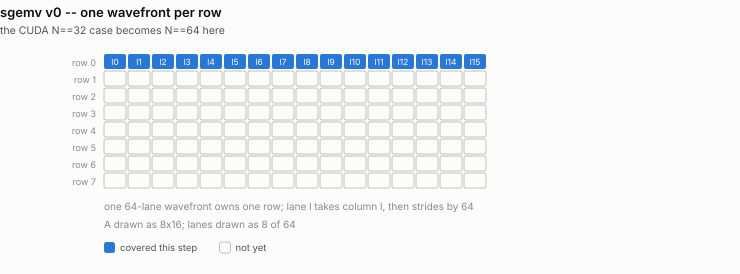
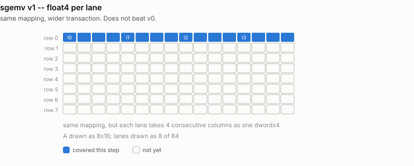
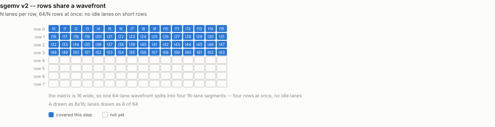
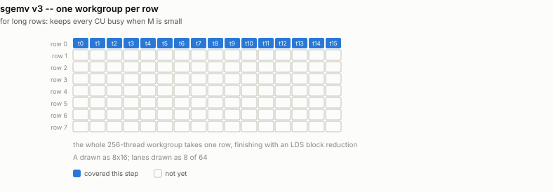
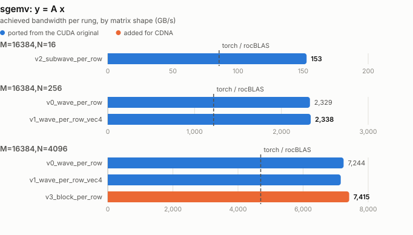

# sgemv -- shaping rows onto the wavefront

Ports `sgemv/Sgemv_v0.cu` (N == 32), `Sgemv_v1.cu` (N >= 128) and
`Sgemv_v2.cu` (N <= 16).

The original's thesis is stated in its README: the whole game is mapping rows
onto warps so no lane sits idle. That thesis survives the port unchanged; every
*number* in it does not, because a CDNA wavefront is 64 lanes, not 32.

`y = A x` reads M*N floats and does 2*M*N flops -- one FMA per 4 bytes. It is
hopelessly memory bound at every size, so the headline metric is bandwidth, and
"as fast as rocBLAS" would mean "both are at the memory roof". Here it is faster
than rocBLAS at every shape tested.

## What it computes

```
y[m] = sum over n of A[m][n] * x[n]        for m in 0 .. M-1
```

| operand | shape / dtype | role |
|---|---|---|
| `A` | `f32[M, N]`, row-major | the matrix; dominates all traffic |
| `x` | `f32[N]` | the vector, small enough to stay in cache |
| `y` | `f32[M]` | output |

**Reference:** `(A.double() @ x.double()).float()`, checked to rtol 1e-3 /
atol 1e-3. The reference accumulates in float64 so that it is not itself an f32
summation carrying error of the same order as the kernel's.

**Metric:** `(M*N + N + M) * 4 bytes / time`, with `2*M*N flops / time`
alongside. A is read once and reused zero times, so this is **one FMA per 4
bytes** -- memory-bound at every size, which is why bandwidth is the headline
and "as fast as rocBLAS" would mean "both are at the memory roof".

## Rungs

| file | what it does |
|---|---|
| `sgemv_v0_wave_per_row.py` | one wavefront per row, one column per lane |
| `sgemv_v1_wave_per_row_vec4.py` | one wavefront per row, float4 per lane |
| `sgemv_v2_subwave_per_row.py` | 64/N rows per wavefront, N lanes each |
| `sgemv_v3_block_per_row.py` | one workgroup per row + LDS block reduce |

## Where this departs from the CUDA original

- `v0` -- one wavefront per row, one column per lane -- is the **N == 64** case
  here, not N == 32.
- `v2` divides 64 by N rather than 32, so N = 16 puts **four** rows in a
  wavefront where CUDA put two.
- `v3` has no CUDA counterpart. When N is large the row is long enough that one
  wavefront per row leaves the machine underfilled at small M; a whole 256-thread
  workgroup per row, finished with an LDS block reduction, keeps every CU busy.

## How each rung accesses memory

One picture per rung, showing exactly which thread touches which
element and when -- the thing that actually changes from one rung to
the next. Counts are scaled down to fit a page (16 threads for 256,
8 lanes for 64); the shapes are exact.

### `v0_wave_per_row`

1 wavefront per row, 1 column per lane

<picture>
  <source media="(prefers-color-scheme: dark)" srcset="../figure/access/sgemv-v0-dark.svg">
  
</picture>

### `v1_wave_per_row_vec4`

1 wavefront per row, float4 per lane

<picture>
  <source media="(prefers-color-scheme: dark)" srcset="../figure/access/sgemv-v1-dark.svg">
  
</picture>

### `v2_subwave_per_row`

64/N rows per wavefront, N lanes each

<picture>
  <source media="(prefers-color-scheme: dark)" srcset="../figure/access/sgemv-v2-dark.svg">
  
</picture>

### `v3_block_per_row`

1 workgroup per row + LDS block reduce

<picture>
  <source media="(prefers-color-scheme: dark)" srcset="../figure/access/sgemv-v3-dark.svg">
  
</picture>

<picture>
  <source media="(prefers-color-scheme: dark)" srcset="../figure/sgemv-dark.svg">
  
</picture>

## Results

> Measured on an AMD Instinct MI350X VF (gfx950, wave64), 256 CU @ 2.2 GHz,
> ROCm 7.2, FlyDSL 0.2.4. Unofficial -- see the disclaimer in the top-level README.

| shape | best rung | GB/s | vs rocBLAS |
|---|---|---|---|
| M=16384, N=16 | `v2_subwave_per_row` | 154 | **1.81x** |
| M=16384, N=64 | `v0_wave_per_row` | 588 | **1.80x** |
| M=16384, N=256 | `v0_wave_per_row` | 2298 | **1.89x** |
| M=16384, N=4096 | `v3_block_per_row` | 7419 | **1.56x** |
| M=1024, N=16384 | `v3_block_per_row` | 6237 | **1.95x** |

The long-row case reaches **7.4 TB/s, 93% of HBM peak**. Note that `v1`
(float4) never beats `v0` (scalar): at one wavefront per row the kernel is
already issuing enough parallel loads, so the wider transaction buys nothing --
the same result the elementwise ladder's `v3` rung shows.
