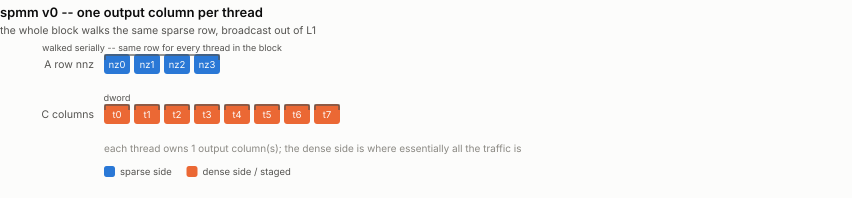
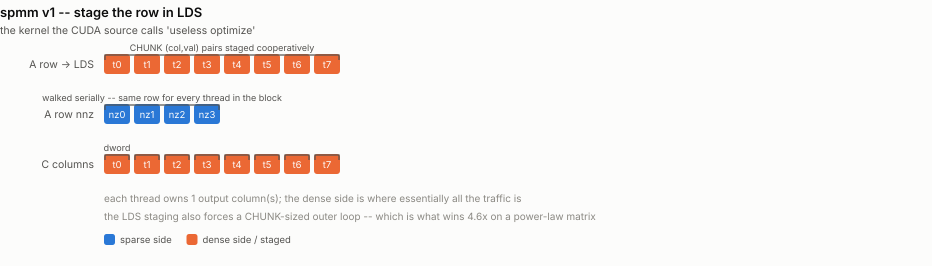
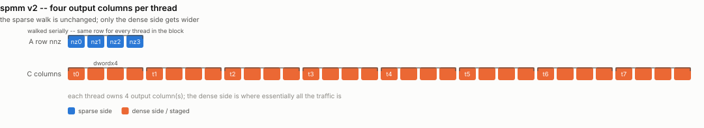
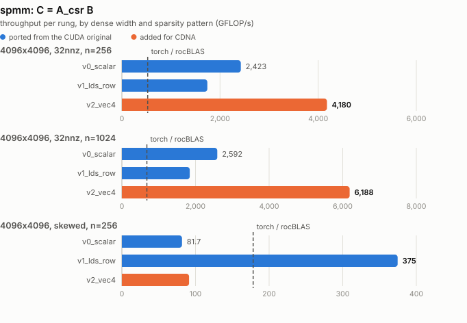

# spmm -- reusing the sparse row across dense columns

Ports `spmm/spmm.cu`.

Its two kernels answer one question: given that a CSR row must be walked
serially, what does a thread block do with the fact that *every* output column of
that row walks the **same** row?

## What it computes

The same CSR matrix, now times a **dense matrix** rather than a vector:

```
C[r][j] = sum over k in [row_offset[r], row_offset[r+1]) of
              value[k] * B[ col_index[k] ][j]
```

| operand | shape / dtype | role |
|---|---|---|
| `row_offset` | `i32[rows+1]` | CSR row pointers |
| `col_index` | `i32[nnz]` | the column of each non-zero |
| `value` | `f32[nnz]` | the non-zeros |
| `B` | `f32[cols, ncols]` | the dense operand -- where nearly all the traffic is |
| `C` | `f32[rows, ncols]` | output |

The structural difference from spmv is that **every one of the `ncols` output
columns walks the same sparse row**. The sparse side is read redundantly and is
nearly free (it broadcasts out of L1); the dense side is the entire cost. That
is why the winning rung widens the dense access and leaves the row walk alone.

**Reference:** `torch.sparse_csr_tensor(...) @ B`, checked to rtol/atol 1e-4.
Matrices come from `common/sparse.py` with a fixed seed, as in spmv.

**Metric:** `2*nnz*ncols flops / time`, with
`(nnz*ncols + rows*ncols) * 4 bytes / time` alongside. Note this counts
*logical* traffic: `B` is re-read often enough to be served largely from cache,
which is why spmm plots above the HBM roof in the roofline chart.

## Rungs

| file | what it does |
|---|---|
| `spmm_v0_scalar.py` | one block per (row, column-chunk), one output column per thread |
| `spmm_v1_lds_row.py` | stage the row's `(col_index, value)` pairs in LDS first |
| `spmm_v2_vec4.py` | four output columns per thread, `buffer_load_dwordx4` on B |

`v0` is the CUDA `My_spmm_csr_vector_kernel_v0`. The whole block reads the same
`(col_index, value)` pair on every step, which looks wasteful and mostly is not
-- the pair is broadcast out of L1.

`v2` has no CUDA counterpart and is where the real win is: the sparse row walk is
unchanged, only the dense side gets wider, and the dense side is all of the
traffic.

## The "useless optimize" comment

`v1` is the kernel the CUDA source itself labels `// useless optimize`. The
measurement splits that verdict in two.

**On a uniform matrix the verdict holds exactly**: 0.72x, pure overhead, just as
the comment predicts.

**On a power-law matrix the same kernel is 4.6x faster than `v0`.** The reason is
not the LDS at all -- it is the `CHUNK`-sized outer loop that staging forces,
which converts one thread's unboundedly long row walk into a sequence of
barrier-synchronised passes that the whole workgroup advances through together.
"Useless" was measured on balanced matrices; it does not survive contact with a
real graph.

## How each rung accesses memory

One picture per rung, showing exactly which thread touches which
element and when -- the thing that actually changes from one rung to
the next. Counts are scaled down to fit a page (16 threads for 256,
8 lanes for 64); the shapes are exact.

### `v0_scalar`

1 output column per thread, scalar B loads

<picture>
  <source media="(prefers-color-scheme: dark)" srcset="../figure/access/spmm-v0-dark.svg">
  
</picture>

### `v1_lds_row`

stage the row's (col,val) pairs in LDS first

<picture>
  <source media="(prefers-color-scheme: dark)" srcset="../figure/access/spmm-v1-dark.svg">
  
</picture>

### `v2_vec4`

4 output columns per thread, float4 B loads

<picture>
  <source media="(prefers-color-scheme: dark)" srcset="../figure/access/spmm-v2-dark.svg">
  
</picture>

<picture>
  <source media="(prefers-color-scheme: dark)" srcset="../figure/spmm-dark.svg">
  
</picture>

## Results

> Measured on an AMD Instinct MI350X VF (gfx950, wave64), 256 CU @ 2.2 GHz,
> ROCm 7.2, FlyDSL 0.2.4. Unofficial -- see the disclaimer in the top-level README.

GFLOP/s:

| rung | n=256 | n=1024 | skewed, n=256 |
|---|---|---|---|
| `v0_scalar` | 2418 | 2569 | 82.6 |
| `v1_lds_row` | 1754 | 1849 | **376.5** |
| `v2_vec4` | **4182** | **6202** | 93.6 |
| *torch CSR* | *527* | *682* | *179* |
