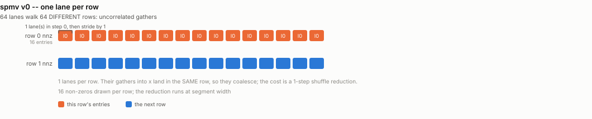
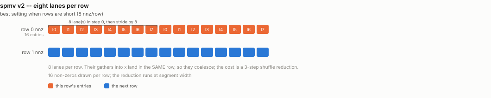
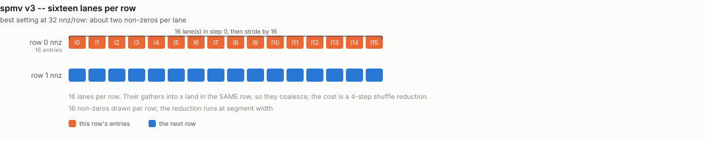
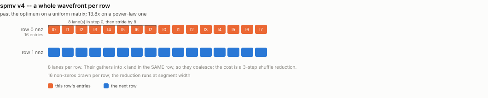

# spmv -- the lanes-per-row knob

Ports `spmv/spmv.cu`.

That file is a single kernel with one knob, `THREADS_PER_VECTOR`: how many lanes
cooperate on one CSR row. The knob is the whole lesson. Too few and a long row
serialises; too many and most lanes sit idle on a short row while the cross-lane
reduction costs more than the row does. The right value tracks the average
non-zeros per row, so the ladder below is that knob swept, not a sequence of
different algorithms.

On CDNA the available segment widths are divisors of **64**, so the useful
settings are 1, 2, 4 ... 64 rather than CUDA's 1..32, and the top setting is a
full wavefront per row rather than two warps' worth.

## What it computes

A sparse matrix in **CSR** times a dense vector:

```
y[r] = sum over j in [row_offset[r], row_offset[r+1]) of
           value[j] * x[ col_index[j] ]
```

| operand | shape / dtype | role |
|---|---|---|
| `row_offset` | `i32[rows+1]` | row pointers; row `r` occupies `[row_offset[r], row_offset[r+1])` |
| `col_index` | `i32[nnz]` | the column of each non-zero |
| `value` | `f32[nnz]` | the non-zeros |
| `x` | `f32[cols]` | dense input vector |
| `y` | `f32[rows]` | output |

The inner term `x[col_index[j]]` is an **indirect** load -- a gather whose
address is itself loaded from memory. That single fact drives the whole ladder:
it is one dependent load per non-zero with no locality guarantee, which is why
SpMV never approaches peak bandwidth no matter how the lanes are arranged.

**Reference:** `torch.sparse_csr_tensor(...) @ x`, checked to rtol/atol 1e-4.
Matrices are generated by `common/sparse.py` from a fixed seed. The CUDA
original reads `.mtx` files from a `matrix/` directory that is not in the
repository, so its sparse benchmarks are not reproducible as shipped; these are.

**Metric:** `2*nnz flops / time`, with `nnz*12 bytes / time` alongside (a value,
a column index, and one gathered `x` element per non-zero). `nnz` is exact for
the uniform patterns and the mean for the skewed one.

## Rungs

| file | lanes per row |
|---|---|
| `spmv_v0_thread_per_row.py` | 1 |
| `spmv_v1_4_lanes.py` | 4 |
| `spmv_v2_8_lanes.py` | 8 |
| `spmv_v3_16_lanes.py` | 16 |
| `spmv_v4_wave_per_row.py` | 64 |

The five files are identical but for the `LANES_PER_ROW` constant at the top --
which is the point: the original is one kernel with one knob.

## Matrices

The CUDA repo reads SuiteSparse `.mtx` files from a `matrix/` directory that is
not in the repository, so its sparse benchmarks are not reproducible as shipped.
`common/sparse.py` generates them instead, with a fixed seed: a `uniform`
pattern (every row the same length, perfect load balance) and a `skewed`
power-law pattern with the same mean, which is what real graphs look like.

## How each rung accesses memory

One picture per rung, showing exactly which thread touches which
element and when -- the thing that actually changes from one rung to
the next. Counts are scaled down to fit a page (16 threads for 256,
8 lanes for 64); the shapes are exact.

### `v0_thread_per_row`

1 lane per row (the classic scalar CSR kernel)

<picture>
  <source media="(prefers-color-scheme: dark)" srcset="../figure/access/spmv-v0-dark.svg">
  
</picture>

### `v1_4_lanes`

4 lanes per row

<picture>
  <source media="(prefers-color-scheme: dark)" srcset="../figure/access/spmv-v1-dark.svg">
  
</picture>

### `v2_8_lanes`

8 lanes per row

<picture>
  <source media="(prefers-color-scheme: dark)" srcset="../figure/access/spmv-v2-dark.svg">
  
</picture>

### `v3_16_lanes`

16 lanes per row

<picture>
  <source media="(prefers-color-scheme: dark)" srcset="../figure/access/spmv-v3-dark.svg">
  
</picture>

### `v4_wave_per_row`

a full 64-lane wavefront per row

<picture>
  <source media="(prefers-color-scheme: dark)" srcset="../figure/access/spmv-v4-dark.svg">
  
</picture>

<picture>
  <source media="(prefers-color-scheme: dark)" srcset="../figure/spmv-dark.svg">
  
</picture>

## Results

> Measured on an AMD Instinct MI350X VF (gfx950, wave64), 256 CU @ 2.2 GHz,
> ROCm 7.2, FlyDSL 0.2.4. Unofficial -- see the disclaimer in the top-level README.

GFLOP/s:

| lanes/row | 32 nnz/row | 8 nnz/row | skewed (power-law) |
|---|---|---|---|
| 1 | 50.9 | 160.7 | 5.1 |
| 4 | 142.7 | 308.2 | 13.1 |
| 8 | 255.0 | **312.7** | 18.9 |
| 16 | **308.7** | 246.8 | 29.8 |
| 64 (full wave) | 235.3 | 84.7 | **70.3** |

The knob has a real optimum and it tracks the average row length: 8 lanes at
8 nnz/row, 16 at 32 nnz/row. Going wider than the rows are long costs
performance -- the 64-lane setting is the *worst* choice at 8 nnz/row (0.53x the
scalar kernel).

On the power-law matrix that reverses completely: **a full wavefront per row is
13.8x the scalar kernel**, because the wavefront is what absorbs the load
imbalance. The right knob setting is a property of the matrix, not of the
hardware.

All three shapes beat PyTorch's CSR `mv` by 1.7x to 48x, but that is not a tuned
path and the comparison should not be read as a rocSPARSE result.
